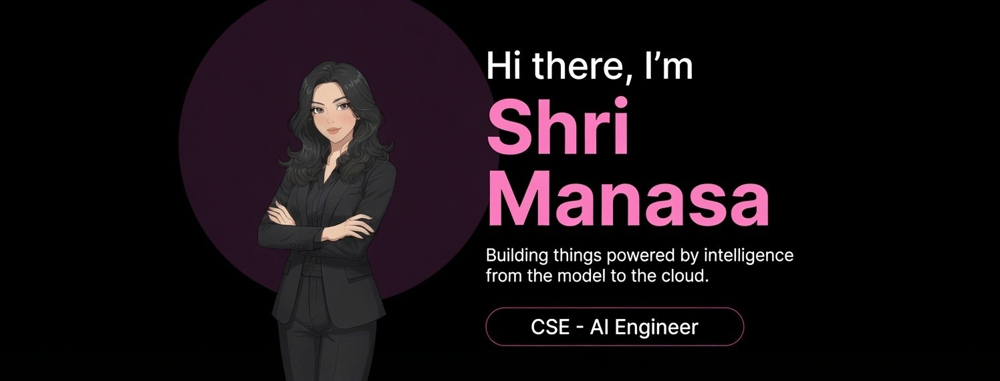

  

 

  <b>AI/ML Engineer · Research Author · CS Student </b>

  
  
  

---

### About Me

I'm a third year Computer Science & AI Engineering student with a focus on **Machine Learning, LLMs, and Agentic AI Systems**. I build things that sit at the intersection of research and real world applications.

### Tech Stack

**AI / ML**

**Agentic / LLM Stack**

**Dev Tools & Languages**

---

### Featured Projects

| Project | Description | Stack |
|--------|-------------|-------|
| [**PitWall Agent**](https://github.com/shrimanasa/f1-pitwall-copilot) | Multi-agent F1 race strategy advisor | FastAPI · Next.js · React · TypeScript · FastF1 · Python|
---

---

## 📊 My Git Analytics

  
  

  

---

## 🐍 My Contribution Snake

<picture>
  <source media="(prefers-color-scheme: dark)" srcset="https://raw.githubusercontent.com/shrimanasa/shrimanasa/output/github-contribution-grid-snake-dark.svg">
  <source media="(prefers-color-scheme: light)" srcset="https://raw.githubusercontent.com/shrimanasa/shrimanasa/output/github-contribution-grid-snake.svg">
  
</picture>

---

<!--END_SECTION:activity-->
